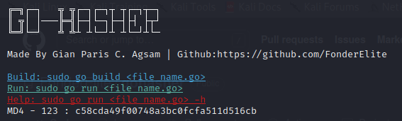

##  Gohasher


##  About
<p>Go Hasher is a tool that can hash your string. Using the different crypto libraries in golang hashing has never been this easy!</p>

## Tools Used
| **Technologies** |    |
**Available Hashing Algorithms**

<ul>
<li>md4</li>
<li>md5</li>
<li>sha1</li>
<li>sha256</li>
<li>sha512</li>
<li>ripemd160</li>
<li>sha3</li>
<li>blake2b</li>
<li>scrypt</li>
<li>argon2</li>
<li>bcrypt</li>
</ul>

##  Installation 
```bash
sudo chmod 777 install.sh
./install.sh
```
##  Usage
```bash
┌──(kali㉿kali)-[~]
└─$ sudo go run hash.go -h      
Usage of /tmp/go-build2475655134/b001/exe/hash:
  -ht string
        Type of hash(md4,md5,sha1,sha256)
  -s string
        String to hash
```


